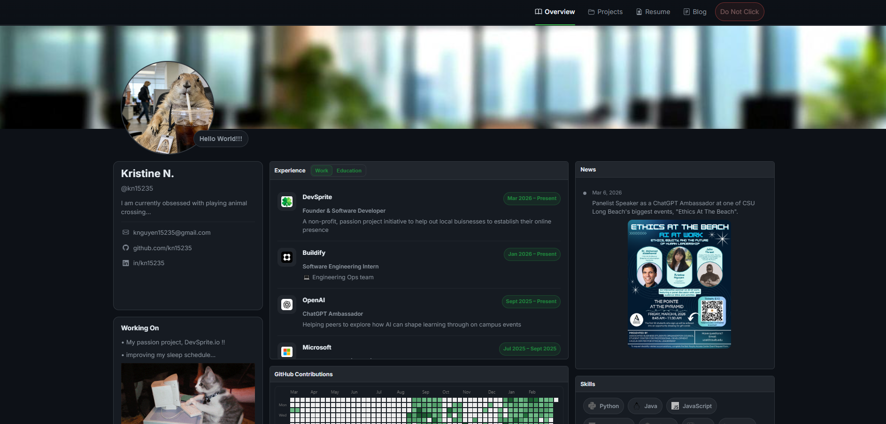

# My Portfolio Website

A personal portfolio website built with HTML, CSS, and JavaScript to showcase my projects, experience, skills, and interests

This project was also built with the help of **Codex**, and it really showed me how powerful AI-assisted development can be. From generating initial ideas to helping debug and refine features, it made the process feel a lot more iterative and creative. It’s pretty amazing how quickly you can go from an idea to a working product, and this site is a reflection of that experience 



## Features
- Overview page with profile, news, and skills
- Dedicated experience page with story-style entries
- Projects explorer
- Blog page
- Responsive multi-page layout
- Animations and transitions

## Tech Stack
- HTML
- CSS
- JavaScript
- Bootstrap Icons
- Google Fonts

## Project Structure
```text
assets/
  css/
  img/
  js/
index.html
experience.html
projects.html
hobbies.html
do-not-click.html
